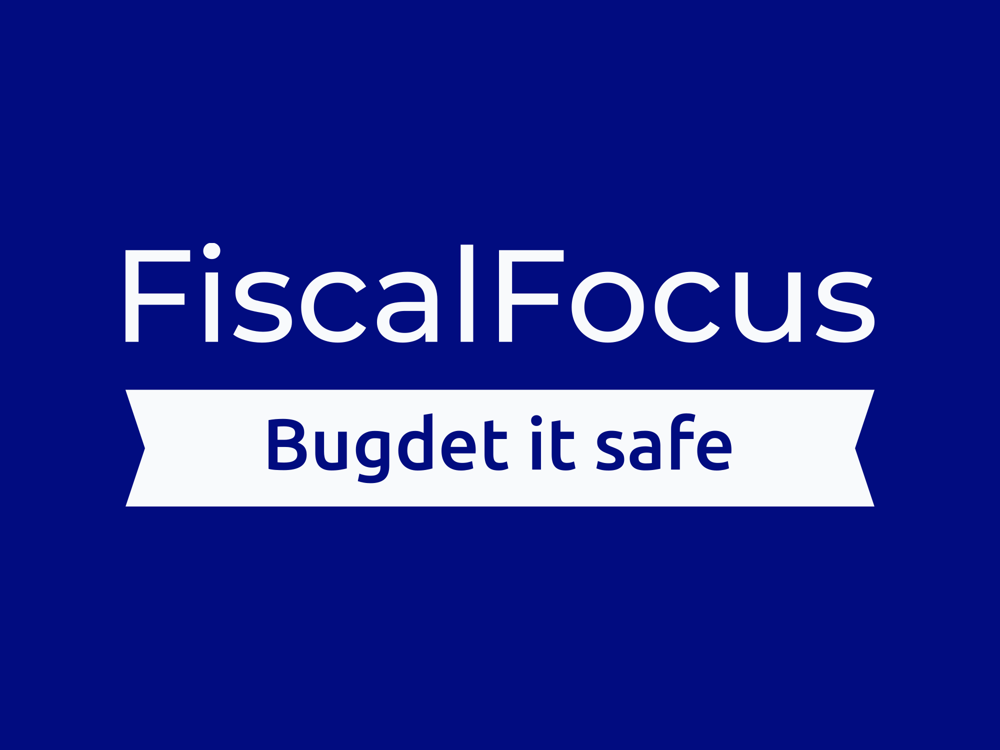

<a name="readme-top"></a>

<div align="center">


  <br/>

</div>

<!-- TABLE OF CONTENTS -->

# 📗 Table of Contents

- [📖 About the Project](#about-project)
  - [🛠 Built With](#built-with)
    - [Tech Stack](#tech-stack)
    - [Key Features](#key-features)
  - [🚀 Live Demo](#live-demo)
- [💻 Getting Started](#getting-started)
  - [Setup](#setup)
  - [Prerequisites](#prerequisites)
  - [Install](#install)
  - [Usage](#usage)
  - [Run tests](#run-tests)
  - [Deployment](#triangular_flag_on_post-deployment)
- [👥 Authors](#authors)
- [🔭 Future Features](#future-features)
- [🤝 Contributing](#contributing)
- [⭐️ Show your support](#support)
- [🙏 Acknowledgements](#acknowledgements)
- [❓ FAQ (OPTIONAL)](#faq)
- [📝 License](#license)

<!-- PROJECT DESCRIPTION -->

# 📖 FiscalFocus web app <a name="about-project"></a>


**FiscalFocus** is a web app that helps users manage their budget. It has the option to set categories, and add data to that categories as per the users description.

## 🛠 Built With <a name="built-with"></a>

### Tech Stack <a name="tech-stack"></a>


<details>
  <summary>Client</summary>
  <ul>
    <li>CSS</a></li>
  </ul>
</details>

<details>
  <summary>Server</summary>
  <ul>
    <li>>Ruby on Rails</a></li>
  </ul>
</details>

<details>
<summary>Database</summary>
  <ul>
    <li><a href="https://www.postgresql.org/">PostgreSQL</a></li>
  </ul>
</details>

<!-- Features -->

### Key Features <a name="key-features"></a>


- **Unique User login**
- **User confirmation**
- **Editing Categories**

<p align="right">(<a href="#readme-top">back to top</a>)</p>

<!-- LIVE DEMO -->

## 🚀 Live Demo <a name="live-demo"></a>


- [Live Demo Link](https://fascalfocus1.onrender.com/)
- [Video link](https://www.loom.com/share/0aeef1725c9b41b8999d66bb4da48ab9)

<p align="right">(<a href="#readme-top">back to top</a>)</p>

<!-- GETTING STARTED -->

## 💻 Getting Started <a name="getting-started"></a>


To get a local copy up and running, follow these steps.

### Prerequisites

In order to run this project you need:
- Ruby 3.1.3 
- Rails 7.0.4 
- Postgress 
- npm


```sh
 gem install rails
```
 -->

### Setup

Clone this repository to your desired folder:


```sh
  cd my-folder
  git clone git@github.com:Sheedrack-Sunday/FascialFocus.git
```


### Install

Install this project with:


```sh
  cd FascialFocus
  gem install
```
--->

### Usage

To run the project, execute the following command:

```sh
  rails server
```
--->

### Run tests

To run tests, run the following command:


```sh
  bin/rails test test/models/<test files>
```

<p align="right">(<a href="#readme-top">back to top</a>)</p>

<!-- AUTHORS -->

## 👥 Authors <a name="authors"></a>


👤 **Author1**

- GitHub: [@Shedraxk-Sunday](https://github.com/Shedrack-Sunday)
- Twitter: [@DeleSundayS](https://twitter.com/DeleSundayS)
- LinkedIn: [Shedrack-Sunday](https://linkedin.com/in/Shedrack-Sunday)


<p align="right">(<a href="#readme-top">back to top</a>)</p>

<!-- FUTURE FEATURES -->

## 🔭 Future Features <a name="future-features"></a>


- [ ] **Section unique users**
- [ ] **Deployment on the Cloud**
- [ ] **Integration with React**

<p align="right">(<a href="#readme-top">back to top</a>)</p>

<!-- CONTRIBUTING -->

## 🤝 Contributing <a name="contributing"></a>

Contributions, issues, and feature requests are welcome!

Feel free to check the [issues page](../../issues/).

<p align="right">(<a href="#readme-top">back to top</a>)</p>

<!-- SUPPORT -->

## ⭐️ Show your support <a name="support"></a>


If you like this project...

<p align="right">(<a href="#readme-top">back to top</a>)</p>

<!-- ACKNOWLEDGEMENTS -->

## 🙏 Acknowledgments <a name="acknowledgements"></a>


I would like to thank Microverse for the initiative 

<p align="right">(<a href="#readme-top">back to top</a>)</p>


<p align="right">(<a href="#readme-top">back to top</a>)</p>

<!-- LICENSE -->

## 📝 License <a name="license"></a>

This project is [MIT](./LICENSE) licensed.


<p align="right">(<a href="#readme-top">back to top</a>)</p>
